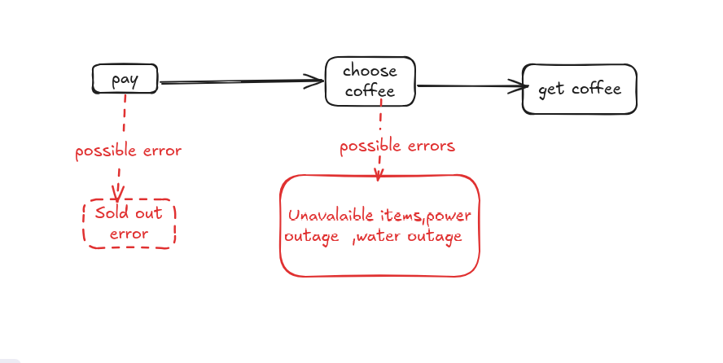

# Coffee Machine Application

A simple simulation of a coffee preparation

## Features

- Accepts money input and validates payment
- Offers coffee selection menu
- Checks availability of water, coffee, and power
- Prepares coffee and returns change
- Handles errors: insufficient funds, out of resources, invalid selection, power issues, maintenance mode

## Components

- **Payment System** – Handles receiving and validating the payment  
- **Inventory System** – Checks the availability of water and coffee  
- **Power Supply** – Ensures the machine is powered and operational

## Error Handling

The Coffee Machine  handles these error cases by stopping the operation and notifying the user:

- **Insufficient Payment:** If inserted money is less than the coffee price.
- **Out of Resources:** If water or coffee beans are unavailable.
- **Invalid Selection:** If the chosen coffee is not on the menu.
- **Power Issues:** If the machine has no power or is malfunctioning.
- **Maintenance Mode:** If the machine is temporarily unavailable for maintenance.

Each error provides a clear message to the user indicating the specific problem.

## Order Process (Modeling)

Below is a visual representation of the coffee ordering process and the possible errors that may occur:

